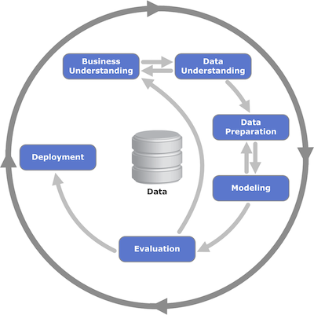
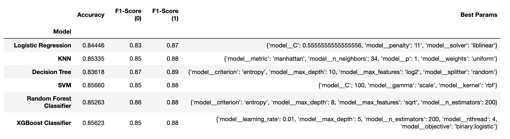
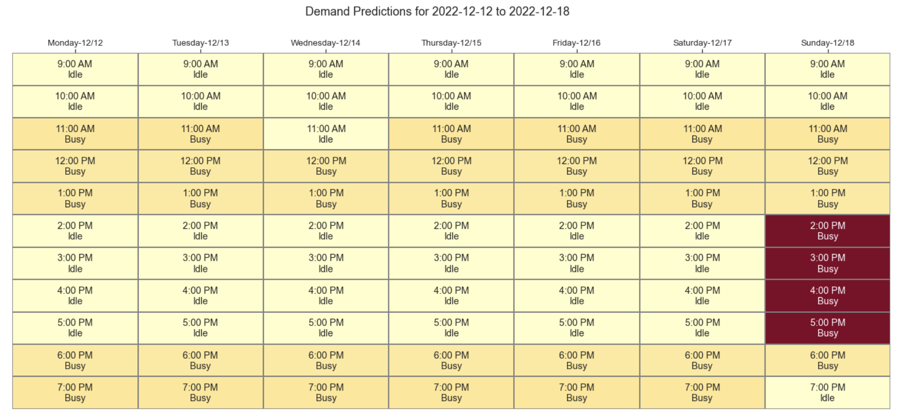
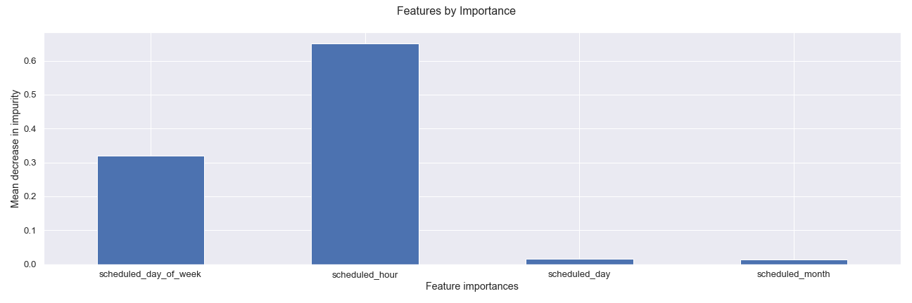

# Inventory Demand Classification for Appointments 
**Using Machine Learning Techniques** 

## Goal

To help business owners answer **What drives demand for appointments in my business?**

Scheduling is a complex problem. Identifying the optimal schedule based on past history of customer preferences, appointments, staff availability, equipment availability, etc., is challenging.
 
By understanding the factors that drive up demand for appointments, business owners can better focus on filling up low demand slots first, then higher demand slots, optimizing for revenue and productivity. 

This is especially useful when a customer arrives to book an appointment either online or through a phone call.

Examples: Salons, Spas, Gyms, Personal Trainer, Dentists etc.,

## Q & A

* How do we source data for this project?

_We use the accompanying synthetic data generation tool to generate appointments for a fictional business. The tool can be reused to generate dataset on different time ranges__

* What techniques do we plan on using for this analysis? 

_Since this is a time series problem, we will use techniques like trend analysis, stationarity test, seasonality analysis, and outlier detection, etc., and also use different classifications techniques to label appointments_

* What are our expected results?

_Based on how easy or difficult to fill up those slots, label the available appointments as 'Low Demand / Idle' or 'High Demand / Busy'._

* Why is this project important?

_The wellness industry is [worth 4.2 trillion dollars](https://policyadvice.net/insurance/insights/health-wellness-industry/) especially the personal care, beauty, and anti-aging sectors are worth 1.08 trillion dollars._

_Many of these businesses in personal care like salons, spas, etc., are appointment-based businesses and have very limited capacity or help manage schedules._

_By building an ML-based solution that provides recommendations to optimize schedules, we will help millions of small businesses increase revenue and reduce drop-offs and cancellations. We will enable these businesses to spend more time with their customers than calendars._

## Methodology 

We have used an industry standard process called [CRISP-DM](https://mo-pcco.s3.us-east-1.amazonaws.com/BH-PCMLAI/module_11/readings_starter.zip) to approach problems like this. We will be using this methodology for our solution.

In the absence of access to a real dataset, we have [used this script](./data/generate.py) to generate synthetic [dataset](./data/reservations-1.csv) for a business called 'Relax Spa'.

- Relax Spa is open during the following hours 
   * Mon - Sat 9am - 9pm
   * Sun 10am - 8pm
- All appointments are 1 hour long 
- All these appointments occurred between 1st January 2018 to 31st December 2019 (Before COVID-19 pandemic)
- Relax Spa is located in Pleasanton, CA

### Modeling Results

Our initial approaches to understand the supply and demand for appointments as a time series model did not work. There were no direct correlations we could identify between past appointments and future ones.

Based on our analysis and modeling using different machine learning techniques, we identified that **XGBoost Classifier** is best suited for our use case. 

Below is a comparison of different modeling techniques we used and related hyper parameters that provide the optimal results.

With the optimal hyper parameters for XGBoost Classifier we obtain the final model, below is the confusion matrix for test and training sets.

### Finding and Observations

Using the model, we can predict future supply and demand for appointments. Here are the predictions we did for the next three weeks (11/28)

As we can observe there are subtle variations in the demand across all the 3 weeks but the general trend stays, across weeks. We are sure to observe much better trends with real data.

### Recommendations and Next Steps

Hour of the appointment has the most influence on the demand, followed by day of the week. Day of the month and month does have relatively less influence

Provisioning more service providers during busy hours and easing them during the less idle hours will yield benefits to the business 

For future iterations obtaining richer datasets that include campaigns, happy hour discounts, etc., can provide more valuable insights into the drivers for demand in appointment slots

## References

* [Modeling Notebook](./notebook.ipynb)
* [Wellness industry is worth 4.2 trillion dollars](https://policyadvice.net/insurance/insights/health-wellness-industry/)
* [Contribution Guidelines](./CONTRIBUTING.md)
* [License](./LICENSE)

